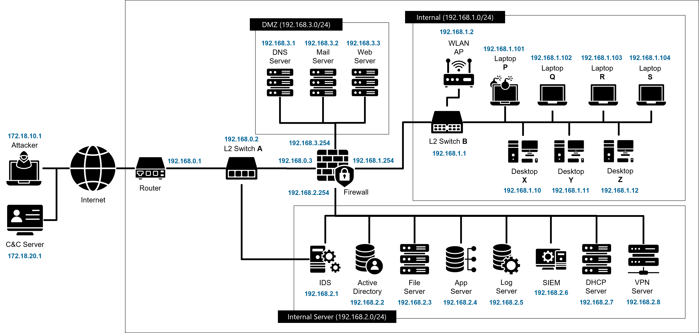

# README

# Network Topology Overview

This document provides a detailed explanation of the network topology used in our usability evaluation of SOC tools.
The topology models a typical small-to-medium enterprise environment and includes a DMZ segment, an internal user network, and an internal server network.
The evaluated SOC tool (Prelude OSS) received logs generated according to this topology and the attack scenarios defined in the study.

## Network Diagram

---

## Topology Description

The network is divided into **three major segments**, each representing a common component of enterprise IT infrastructure:
(1) a perimeter/DMZ zone,
(2) an internal user network, and
(3) an internal server network.
A router and firewall coordinate traffic between these segments, enabling monitoring and log generation similar to a real operational environment.

---

## 1. External Connectivity

The organization connects to two external networks represented by the addresses **172.18.10.1** and **172.18.20.1**.
These external networks serve as potential attack sources during simulated scenarios, such as malware download or external command-and-control activity.

Traffic from outside flows into the enterprise through a **router (192.168.0.1)**, which forwards packets to the internal switching infrastructure.

---

## 2. L2 Switch A (192.168.0.2)

Switch A provides connectivity between the router, the firewall, and the lower internal network.
It essentially acts as the distribution switch linking the outside world to the internal infrastructure.
Traffic passing through this switch generates logs that are later consumed by the SIEM.

---

## 3. DMZ Segment (192.168.3.0/24)

A dedicated DMZ zone hosts public-facing servers that can be accessed from external networks:

* **DNS Server (192.168.3.1)**
* **Mail Server (192.168.3.2)**
* **Web Server (192.168.3.3)**

These servers are connected to the firewall via **192.168.3.254** and can be targets for reconnaissance or pivoting during simulated attacks.
Logs from these hosts contribute to analyzing early-stage attack indicators.

---

## 4. Firewall (192.168.3.254 / 192.168.1.254 / 192.168.2.254)

The firewall acts as the central control point that enforces network segmentation.
It connects three subnets:

* DMZ (192.168.3.0/24)
* Internal User Network (192.168.1.0/24)
* Internal Server Network (192.168.2.0/24)

It generates logs for:

* Access control decisions
* Administrative logins
* Configuration changes
* Allowed or blocked traffic flows

These logs are essential for evaluating whether the SOC tool can help analysts identify configuration tampering or suspicious access flow patterns.

---

## 5. Internal User Network (192.168.1.0/24)

This network represents typical end-user devices inside an enterprise.
It is connected through **L2 Switch B (192.168.1.1)** and contains:

* **WLAN Access Point (192.168.1.2)**
* **Laptops (P: .101, Q: .102, R: .103, S: .104)**
* **Desktops (X: .10, Y: .11, Z: .12)**

These devices generate logs related to:

* User authentication
* Internal lateral movement
* Abnormal access to servers
* Malware execution events

In the evaluation, compromised user machines were used as pivot points for simulated attacker actions.

---

## 6. Internal Server Network (192.168.2.0/24)

This segment contains key enterprise servers typically monitored by a SOC:

* **IDS (192.168.2.1)**
* **Active Directory (192.168.2.2)**
* **File Server (192.168.2.3)**
* **Application Server (192.168.2.4)**
* **Log Server (192.168.2.5)**
* **SIEM Server (192.168.2.6)**
* **DHCP Server (192.168.2.7)**
* **VPN Server (192.168.2.8)**

These systems generate high-value logs such as authentication events, file access, service usage, and anomaly alerts.
Simulated attack scenarios involved data access and exfiltration via the file server, along with IDS alerts triggered by reconnaissance activities.

---

## 7. Overall Characteristics

This network topology is designed to reflect:

* realistic enterprise segmentation (DMZ / users / servers)
* common IT operational components
* traffic flows that generate diverse log sources
* conditions under which Tier-1 SOC analysts typically work

By structuring the topology in this way, the evaluation environment supports:

* high-fidelity alert generation
* reproduction of common cyberattack chains
* appropriate contextual information for SOC usability testing

# Simulated Attack Scenario Details

This document summarizes the detailed host settings and attack timelines used to generate synthetic logs for the usability evaluation.
The content corresponds directly to the CSV data used in the log-generation process but is reorganized for clarity.

---

# 1. Host Configuration

Below is the list of hosts included in the simulated enterprise environment.
Roles, IP addresses, and provided services are shown along with additional notes when relevant.

## 1.1 Host List

### External / Attacker Infrastructure

* **Attacker** — 172.18.10.1
* **C&C Server** — 172.18.20.1

### Network Infrastructure

* **Router** — 192.168.0.1
* **L2 Switch A** — 192.168.0.2

  * Port mirroring enabled for IDS packet capture
* **Firewall**

  * 192.168.0.3
  * 192.168.1.254
  * 192.168.2.254
  * 192.168.3.254
* **L2 Switch B** — 192.168.1.1
* **WLAN Access Point** — 192.168.1.2

### Internal User Devices

* Desktop X — 192.168.1.10 (ssh)
* Desktop Y — 192.168.1.11
* Desktop Z — 192.168.1.12
* Laptop P — 192.168.1.101
* Laptop Q — 192.168.1.102
* Laptop R — 192.168.1.103
* Laptop S — 192.168.1.104

### Internal Servers

* IDS — 192.168.2.1
* Active Directory — 192.168.2.2
* File Server — 192.168.2.3 (SMB)
* Application Server — 192.168.2.4 (Web)
* Log Server — 192.168.2.5 (Syslog)
* SIEM — 192.168.2.6
* DHCP Server — 192.168.2.7
* VPN Server — 192.168.2.8 (IKE, IPSec ESP)

### DMZ Servers

* DNS Server — 192.168.3.1
* Mail Server — 192.168.3.2
* Web Server — 192.168.3.3
* Proxy Server — 192.168.3.4

---

# 2. Attack Scenario 1 — Malware Infection

This scenario models a typical intrusion chain where an internal user executes a malicious attachment, allowing the attacker to pivot and exfiltrate data.

## 2.1 Timeline Overview

### 14:26:16 — Malware Execution

* User on **192.168.1.101 (Laptop P)** executes a malicious email attachment.
* Device contacts **C2 server (172.18.20.1)** via HTTPS.

### 14:26:19 — Command and Control

* C2 instructs malware to download components.
* Traffic: HTTPS from 172.18.20.1 → 192.168.1.101.

### 14:26:26 — Malware Installation

* Malware installs and activates (no direct logs generated).

---

## 2.2 Host Discovery Phase (14:31:24–14:44:37)

The infected host performs extensive scanning across all subnets.

### Network Scanning

* Command: `nmap -sn 192.168.*.*`
* Source: 192.168.1.101
* Targets: All devices from 192.168.1.1 to 192.168.3.254

### Service Enumeration

Commands include:

* `nmap -sV 192.168.1.1–104`
* `nmap -sV 192.168.2.1–8`
* `nmap -sV 192.168.3.1–4`

### OS Detection

Commands include:

* `nmap -sO <all hosts in 192.168.*.*>`

### Phase End

* 14:44:37 — Information gathering completed.

---

## 2.3 Firewall Evasion & Configuration Tampering (14:59:56–15:06:11)

### 14:59:56

* Infected host accesses firewall Web UI:

  * TCP/443 from 192.168.1.101 → 192.168.1.254

### Login Attempts

* Multiple HTTPS login attempts to firewall admin interface.

### 15:06:11 — Firewall Configuration Change

* Attacker modifies firewall settings to suppress logs and bypass detection.
* After this moment, the SIEM receives no further logs from affected segments.

---

## 2.4 Data Exfiltration Phase (15:21–15:40)

### Access to File Server (SMB)

* 192.168.1.101 connects to **192.168.2.3** via SMB.
* Attacker:

  * Browses folders
  * Reads sensitive files
  * Downloads all contents
  * Compresses data (zip)

### Exfiltration (15:40:07)

* Compressed data sent via HTTPS to **C&C server 172.18.20.1**.

---

# 3. Attack Scenario 2 — Insider Threat

This scenario represents an attacker who begins with stolen credentials, enabling unauthorized access through SSH and subsequent data theft.

## 3.1 Baseline Activity

* A legitimate pattern of scheduled SSH access:

  * Desktop X (192.168.1.10) → Web Server (192.168.3.3)
* Protocol: TCP/22

---

## 3.2 Unauthorized SSH Login Attempts

### 01:34:49 — Suspicious SSH from External Source

* Attacker at **172.18.10.1** uses stolen credentials
* SSH login to **Web Server (192.168.3.3)**
* Protocol: TCP/22

### 01:39:49 — Lateral Movement Attempt

* SSH login attempt from Web Server → Desktop X
* Source: 192.168.3.3
* Dest: 192.168.1.10

---

## 3.3 Data Theft Phase (01:48–02:07)

### SMB Access to File Server

* 192.168.1.101 (compromised endpoint) → 192.168.2.3 (File Server)

Attacker:

* Browses multiple folders
* Opens sensitive documents
* Downloads entire directory
* Compresses files into ZIP

### Exfiltration

* 02:07:07 — Data sent to **C&C server 172.18.20.1** via HTTPS.

---

# 4. Notes on Log Generation

* All timeline events were converted into structured Syslog-format entries.
* Communication details (source, destination, protocol, timestamps) exactly match the tables above and were used as ground truth for the SIEM ingestion pipeline.
* Firewall configuration change in Scenario 1 intentionally suppresses subsequent logs to simulate real-world detection evasion.
